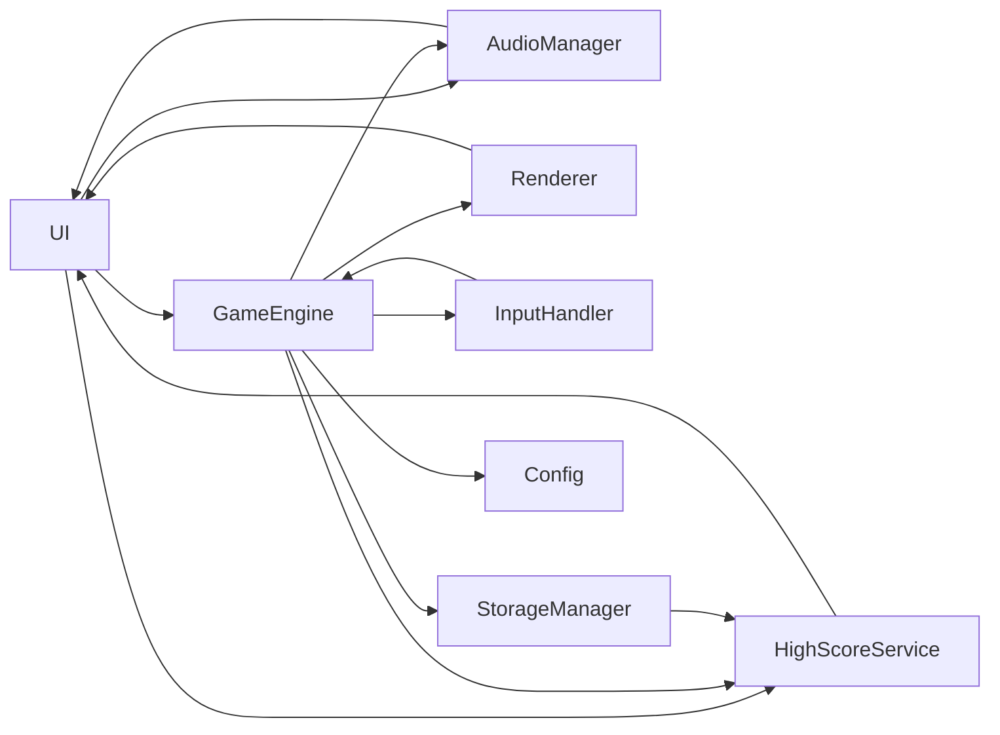

# Architect Mission Report

**Agent**: architect  
**Generated**: 2026-08-13T21:43:26.537Z

---

## Architecture Style

client-server (single-page application)

## Components

- **UI** (ui): React‑like presentation layer built with Preact. Renders screens (Start, Game, Pause, Game Over, High Scores) and displays score, lives, level, and mute button.
- **Game Engine** (service): Core game loop, state machine, level progression, ghost AI, collision detection and scoring logic.
- **Renderer** (service): Draws the maze, Pac‑Man, ghosts, dots, fruits and UI overlays onto an HTML5 Canvas at 60 fps.
- **Input Handler** (service): Normalises keyboard, WASD, touch‑swipe and on‑screen button events and forwards direction intents to the Game Engine.
- **Audio Manager** (service): Plays sound effects and background siren via Howler.js, supports mute/unmute and dynamic pitch changes.
- **Storage Manager** (service): Thin wrapper around IndexedDB (fallback to localStorage) for persisting high‑score list between sessions.
- **High Score Service** (service): Business logic for reading, inserting and ranking top‑10 scores, validates initials and awards extra lives.
- **Config** (shared): Static level‑specific parameters (ghost speed, pellet timers, fruit schedule, difficulty curve).

## Tech Stack

- **frontend**: Preact (with TypeScript) — Preact provides the same JSX component model as React but with a ~3× smaller runtime, keeping the total bundle under the 2 MB limit. Vue is also lightweight but would require a different component syntax and larger ecosystem overhead for a pure game UI.
- **build**: Vite — Vite offers instant dev server start, native ES module handling and highly efficient production bundling with Rollup, resulting in a minimal bundle size. Webpack can achieve similar size but needs more configuration; Parcel is zero‑config but slower and produces larger output.
- **state**: Zustand — Zustand is tiny (≈1 KB), uses simple hooks, and works well with Preact. Redux adds boilerplate and a larger runtime; MobX requires decorators and a different mental model, both unnecessary for a single‑player game.
- **audio**: Howler.js — Howler abstracts cross‑browser quirks, provides simple play/pause/mute APIs and small file size. Tone.js is geared toward music synthesis and is heavier. Pure Web Audio would need more boilerplate for loading multiple short sound effects.
- **testing**: Vitest — Vitest runs in the same Vite environment, shares the same ES module resolution, and has near‑zero config. Jest is larger and requires transpilation; Mocha lacks built‑in snapshot support.
- **e2e**: Playwright — Playwright supports Chromium, Firefox and WebKit out of the box, enabling cross‑browser UI tests on the same codebase. Cypress is Chrome‑only by default and needs extra setup for Firefox/WebKit. Selenium is heavyweight and slower.
- **ci/cd**: GitHub Actions — The repository will live on GitHub; Actions provides free CI minutes, easy matrix builds for browsers, and direct deployment to GitHub Pages. GitLab CI would require moving the repo; CircleCI adds external service overhead.
- **hosting**: GitHub Pages (static) — GitHub Pages can serve the static build directly from the repo, no extra cost, and works well with the Service Worker for offline support. Netlify/Vercel offer similar features but are unnecessary for a single static site.
- **offline**: Vite‑PWA plugin (Workbox) — The plugin generates a standards‑compliant Service Worker with precaching and runtime caching in a few lines, fitting the offline‑first requirement. sw-precache is deprecated; a custom SW would duplicate effort.

## Epics

- **EPIC-001** Core Gameplay Loop: Implement maze rendering, Pac‑Man movement, dot consumption, collision detection and level completion logic.
- **EPIC-002** Ghost AI & Behavior: Create four distinct ghost personalities, chase/scatter timer, tunnel wrapping, and ghost house release sequence.
- **EPIC-003** Power Pellet & Scared Mode: Handle power‑pellet consumption, trigger scared state (color change, speed reduction, direction reversal), flashing timer, and ghost‑eating scoring.
- **EPIC-004** Bonus Fruit System: Spawn fruit at the correct dot counts, display correct sprite, award level‑specific points, and handle timeout disappearance.
- **EPIC-005** Scoring, Lives & Extra Life: Track points for dots, pellets, ghosts, fruit; manage 3 lives, extra life at 10 000 points, and game‑over flow.
- **EPIC-006** User Interface & Navigation: Build Start Screen, Countdown, Pause overlay, Level‑Complete transition, Game‑Over screen with initials entry, and high‑score list display.
- **EPIC-007** Audio System: Integrate all required sound effects, background siren with pitch/tempo changes, and mute/unmute control.
- **EPIC-008** Offline Support & Persistence: Cache all assets with a Service Worker, store high‑score list locally, and ensure the game works without network connectivity.
- **EPIC-009** Accessibility & Color‑Blind Mode: Provide full keyboard navigation, visible focus indicators, ARIA labels, and an alternative ghost‑color palette.
- **EPIC-010** Performance & Responsiveness: Optimize rendering pipeline for 60 fps, ensure bundle stays < 2 MB, and make layout adapt from 375 px phones to 2560 px desktops.

## Architecture Diagram

