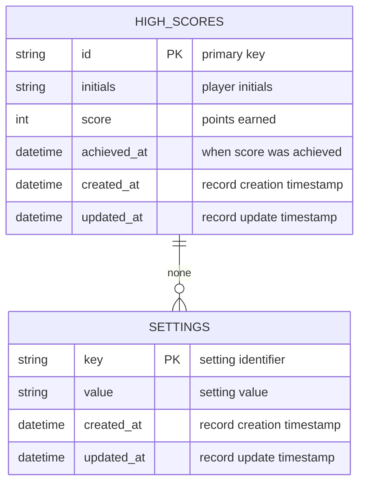

# DBA Mission Report

**Agent**: dba  
**Generated**: 2026-08-13T21:44:24.281Z

---

## Database Engine: IndexedDB

The application is a fully client‑side SPA with offline‑first requirements. IndexedDB provides a native, transactional, key‑value store in the browser, works without any server component, supports indexes for efficient queries (e.g., top‑10 high scores), and gracefully falls back to localStorage when unavailable. It aligns perfectly with the StorageManager service and the need to persist high scores and user preferences between sessions.

## Entities (2)

- **high_scores**: 6 columns
- **settings**: 4 columns

## ERD

